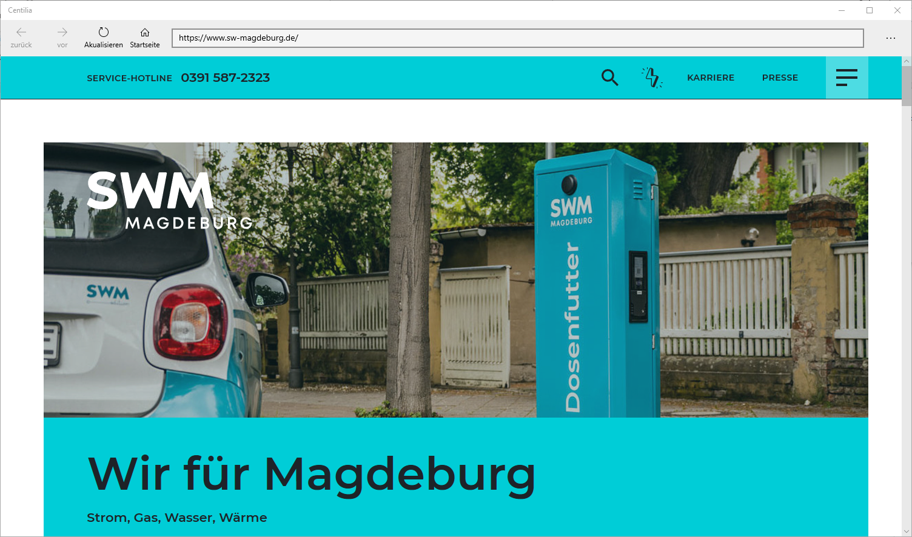

# Centilia

A Universal Windows App displaying a Browser View that can only navigate to pre-configured websites. The app was deployed to a Raspberry Pi in kiosk mode and developed for the Magdeburg municipal utility to show a customer survey website on a touch monitor in the entrance hall. The configuration can be edited during runtime by entering an admin password.

## License

Health Track    
Copyright (C) 2019-2022 Dominik Viererbe

This program is free software: you can redistribute it and/or modify it under the terms of the GNU Affero General Public License as published by the Free Software Foundation, either version 3 of the License, or *(at your option)* any later version.

This program is distributed in the hope that it will be useful, but WITHOUT ANY WARRANTY; without even the implied warranty of MERCHANTABILITY or FITNESS FOR A PARTICULAR PURPOSE. See the GNU Affero General Public License for more details.

You should have received a copy of the GNU Affero General Public License along with this program. If not, see <<https://www.gnu.org/licenses/>>.